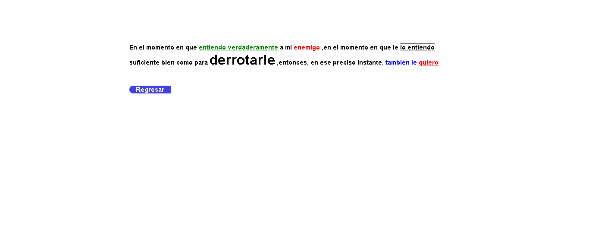

<H1> TALLER 9 <h1>
<h1>BRAYAN DAVID GONZALEZ NOVA</H1>

<h2>INFORMACIÓN</h2>
        
CURSO: Full Stack Básico

        
Profesor:  Cristian Patiño

<H2>Punto 1: LINKS </H2>
<a href="https://www.figma.com/file/Qg8X7d312dmotbTI6GiVf9/Untitled?type=design&t=Kk5dEll79BA3kajg-1" target="_blank">link de figma </a>
 
<a href="https://brayandgn.github.io/Taller-9-FULL-STACK/" target="_blank">link página web </a>

<H2>Punto 2: HTML</H2>

<H2>Punto 3: CSS</H2>

<H2>Punto 4: TITULOS</H2>

<H2>Punto 5: ESTILOS DE TEXTO</H2>

<H2>Punto 6: ENLACES</H2>

<H2>Punto 7-8: NAVEGACIÓN</H2>

<H2>Punto 9: TABLAS</H2>
